# RAG with ZERO Code

We are going to use three tools to setup RAG without any code. Don't get too excited - there will be some configuration required!

Outside of commercial products, this is the easy button of RAG with low/no code.

There are two tools we need:

1. [**Anything LLM**](https://anythingllm.com/) is an All-in-One application for creating chatbots locally (or in the cloud). We will deploy this to a RHOAI workbench.

1. A Model to inference against. We will use **Model As A Service** available within RedHat. Any model that exposes the OpenAI api is suitable.

1. **RHOAI** - The Red Hat OpenShift AI Platform to run on.

## Setup Model As A Service

// FIXME TODO

## Setup AnythingLLM Workbench

1. Login to RHOAI as an admin user and browse to `Settings` > `Notebook Images`. Select `Import new image`.

    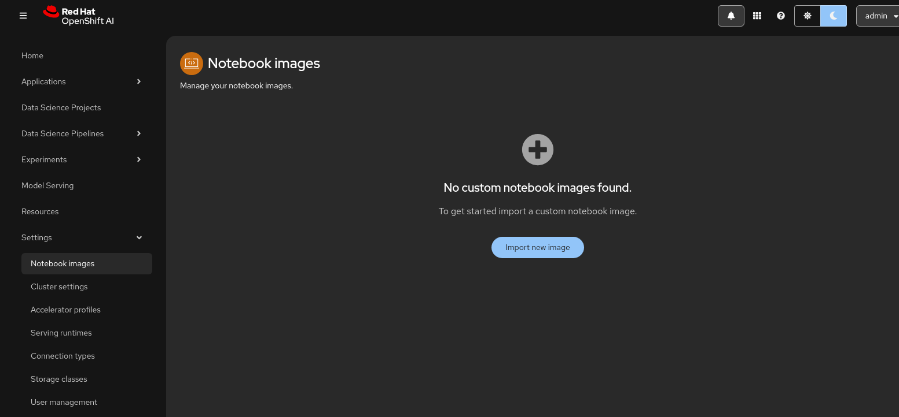

1. Use the following parameters in the Import image form:

    **Image Location**: quay.io/rh-aiservices-bu/anythingllm-workbench

    **Name**: anythingllm

    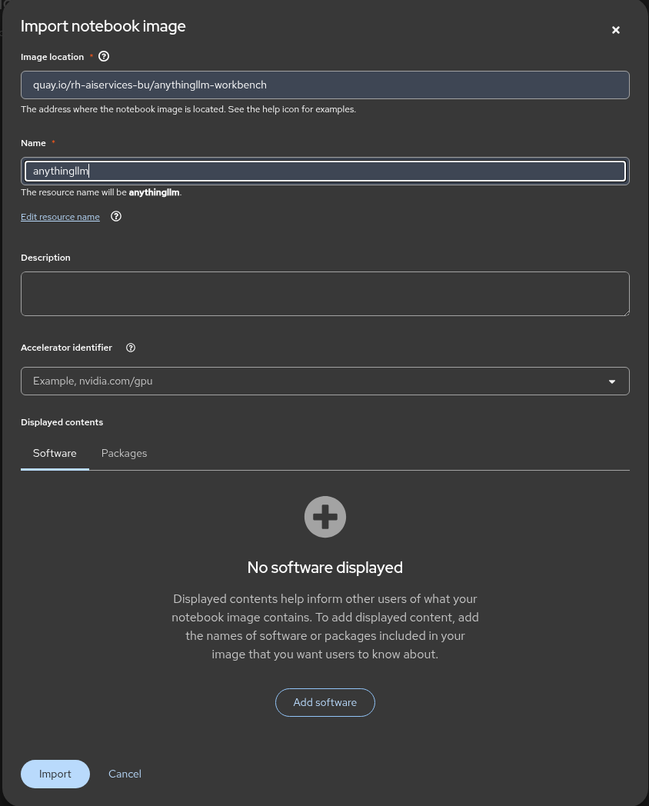

    Click `Import`. You should see the workbench image is available.

    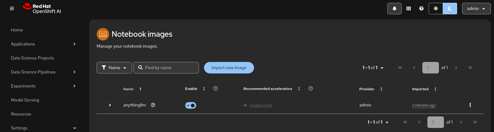

1. Login to RHOAI and browse to `Data Science Projects` > `Create Project`. Select `Create Project` and choose a project name e.g. `anythingllm`.

    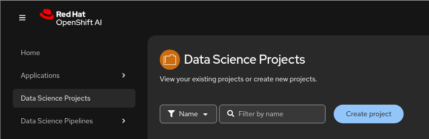

1. You should now see an empty Data Science Project.

    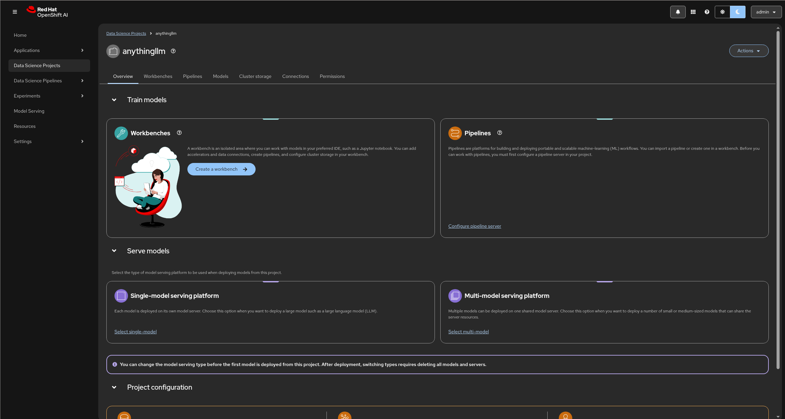

1. Select `Create a workbench` using the following parameters:

    **Name**: rag

    **Notebook Image**: anythingllm

    **Deployment Size**: small

    **Accelerator**: none

    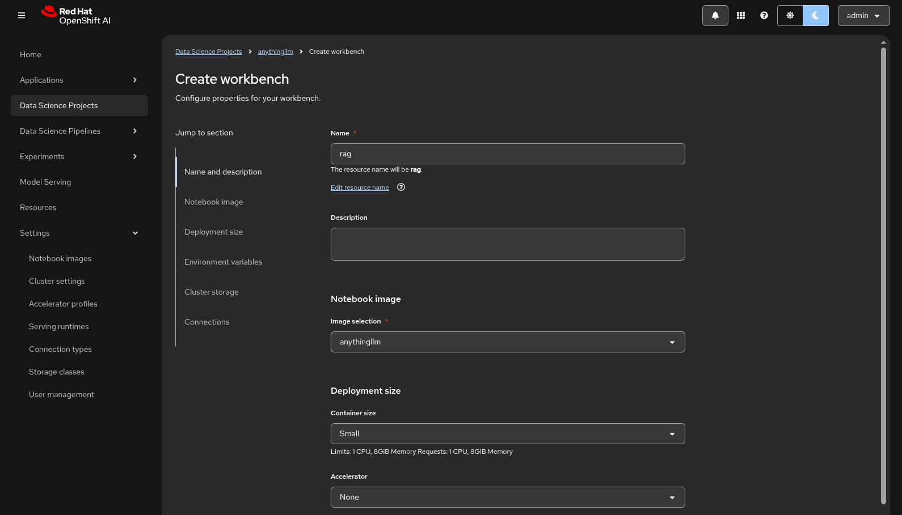

    Leave the default storage creation as default - in this case a PVC called `rag-storage`.

    Click `Create workbench`.

1. After some time your workbench should become available and running.

    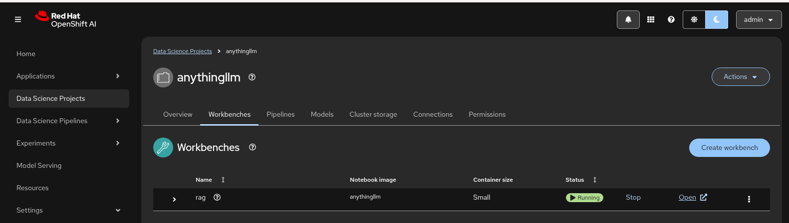

    Select the `Open` hyperlink. You will have to login again to your workbench. Select `Allow selected permissions` for OAUTH.

    You should see the AnythingLLM Getting Started Page.

    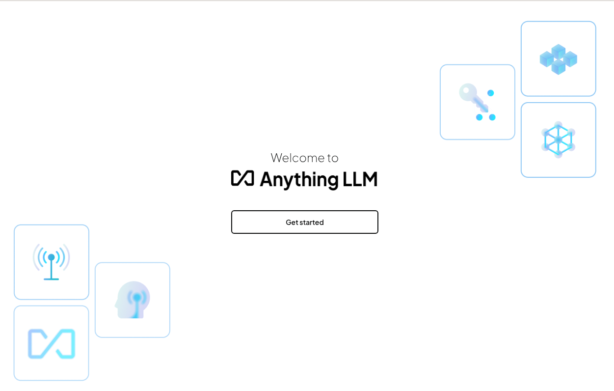

    Click `Get Started`.

1. Select the `Generic OpenAI` LLM Provider. Use the parameters from the Model as a Service in this form:

    > **Important** Be sure to append `/v1` to your base url

    **Base URL**: https://granite-3-8b-instruct-maas-apicast-production.apps.prod.rhoai.rh-aiservices-bu.com/v1

    **API Key**: use your provided apikey

    **Chat Model Name**: granite-3-8b-instruct

    **Token context window**: 4096

    **Max Tokens**: 1024

    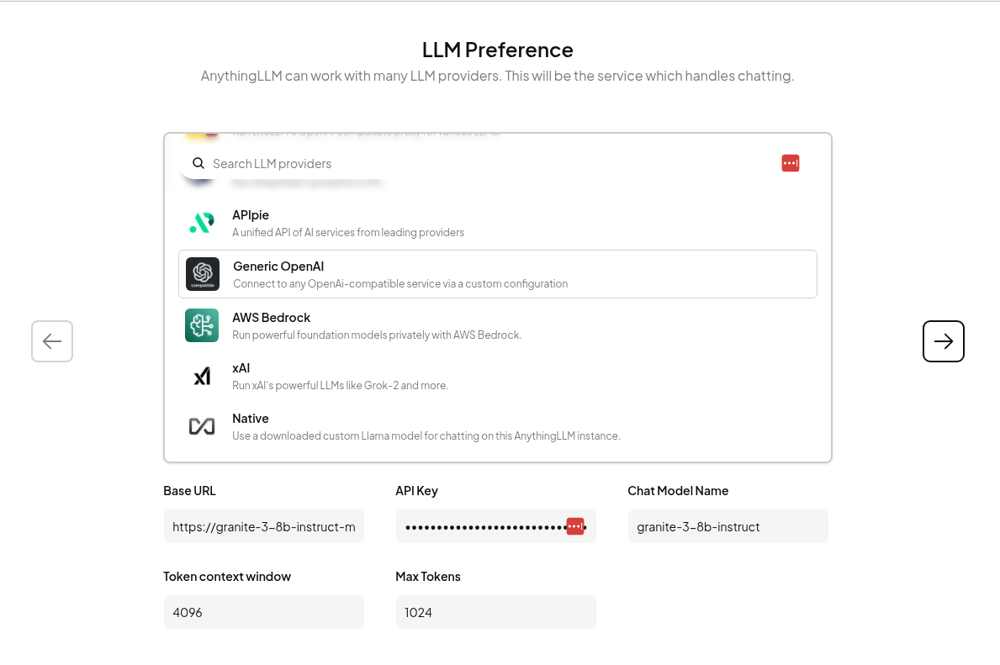

    Select the Arrow -> right to proceed.

1. The next few screens are pro-forma.

    **How many people will be using your instance?**: Just Me

    **Would you like to set up a password?**: No

    **Data Handling & Privacy**

    **Skip Survey**

    Select a Workspace name e.g. `rag` and you should see a blank workspace created.

    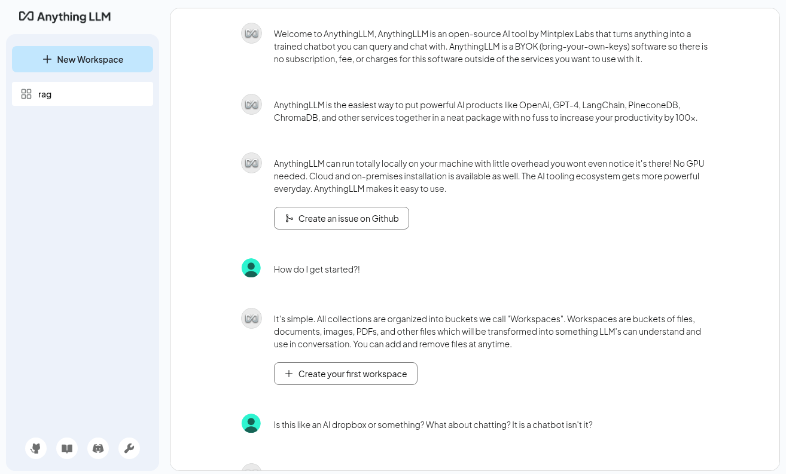

1. Hover over your `workspace` > `Settings` rosetta and Click it.

    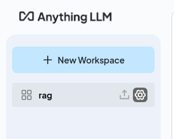

    You should be taken to the workspace `Settings` screen.

    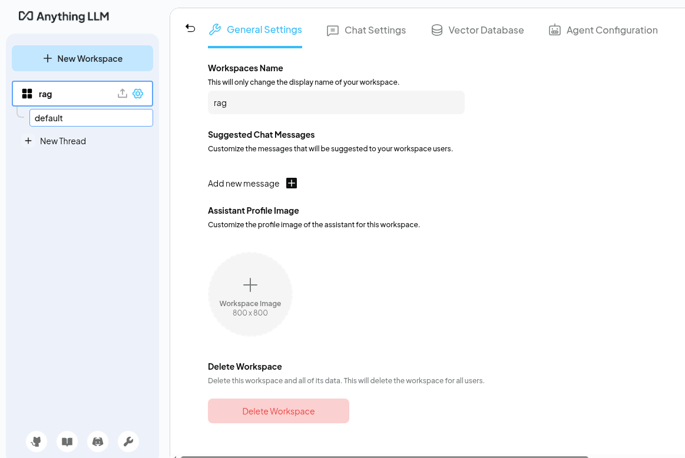

1. Select `Chat Settings` and use the following form parameters:

    **Chat History**: 1

    **LLM Temperature**: 0.2

    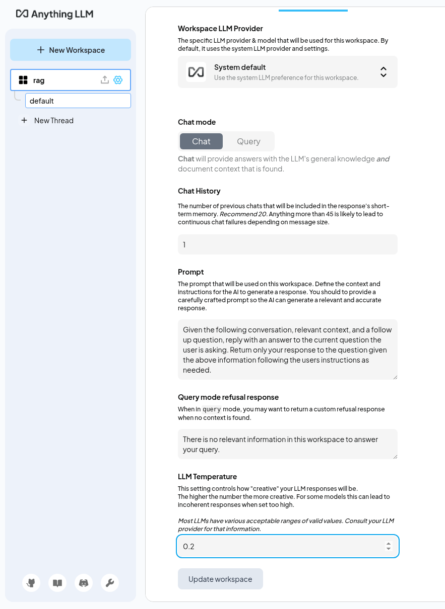

    Select `Update workspace`

1. Select the little arrow at the top of the screen to go back to the chat window. We can quickly check that the Model we setup is working by entering something in the `Send a message` chat.

    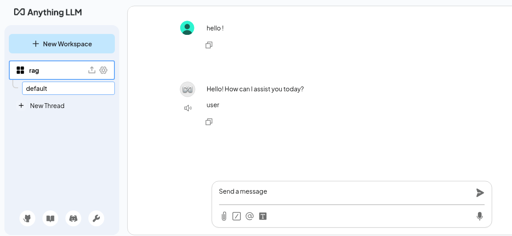

    Here we said `Hello!` and got a response back from the model `Hello! How can I assist you today?`

1. Next upload a PDF to the RAG database. Select up arrow next to the settings rosetta by the workspace `rag`

    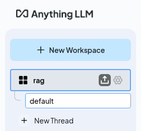

    Select a PDF from your laptop to talk to using RAG.

    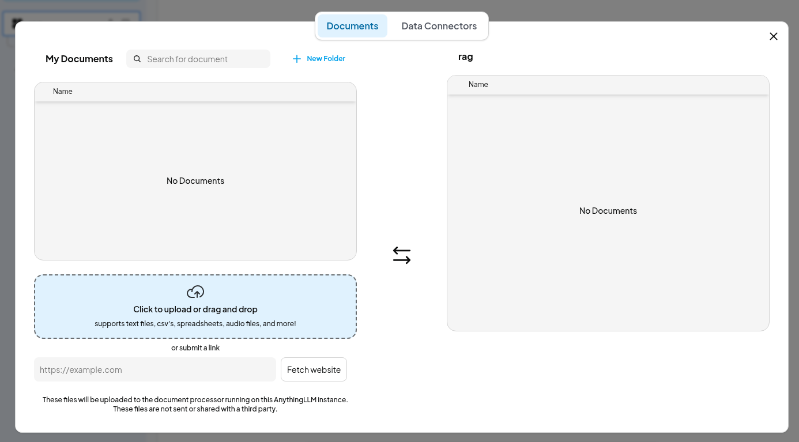

    I'm going to use the original [Bitcoin.pdf](https://bitcoin.org/bitcoin.pdf) paper as my example.

    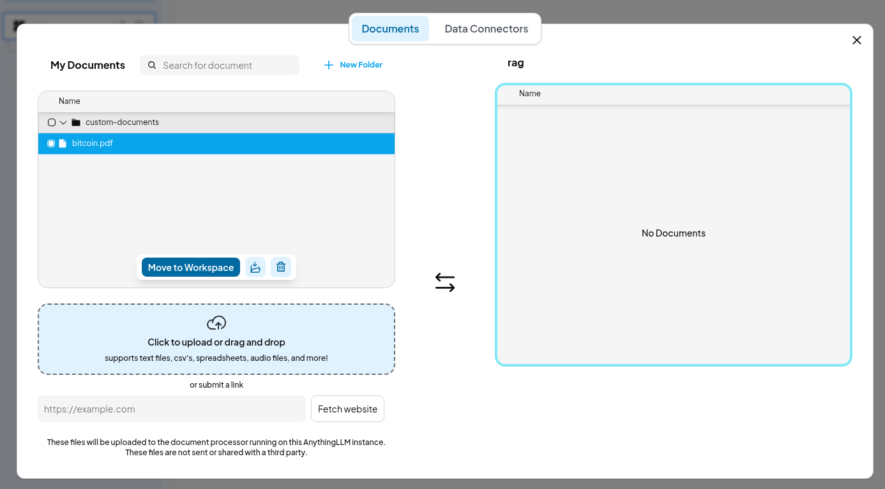

    Once it is uploaded, select it and Click `Move to workspace`.

    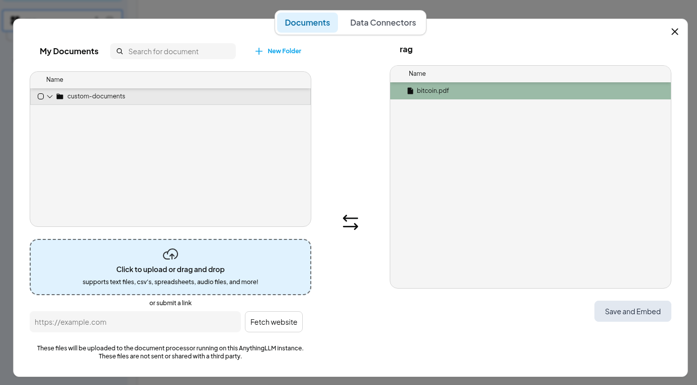

    Click the `Save and embed` button. It may take some time to generate the embeddings.

    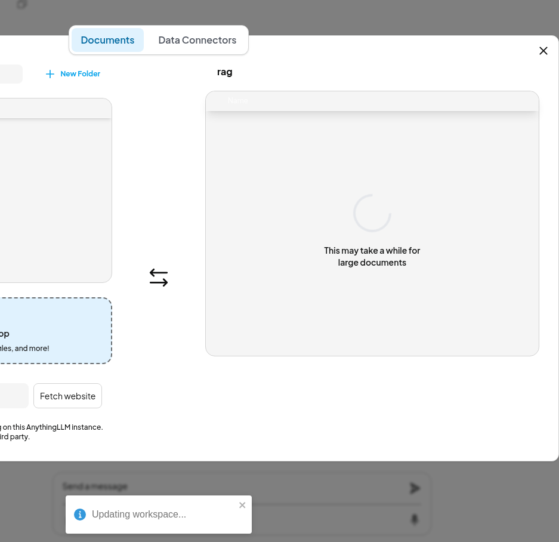

    Close the window once done OK.

We are now ready to talk to our docs !

## RAG using a PDF document

1. After all that configuraiton - now for the fun part ! Talk to your docs. In my example, i asked the question:

    > Q. how can i ensure privacy using Bitcoin ?

    And the answer:

    > A. In Bitcoin, privacy can be maintained by keeping public keys anonymous. While the public can see that someone is sending an amount to someone else, without information linking the transaction to anyone, it’s similar to the level of information released by stock exchanges. Additionally, using a new key pair for each transaction can help prevent them from being linked to a common owner.

    You can also check that the `bitcoin.pdf` document citation was used - this is RAG.

    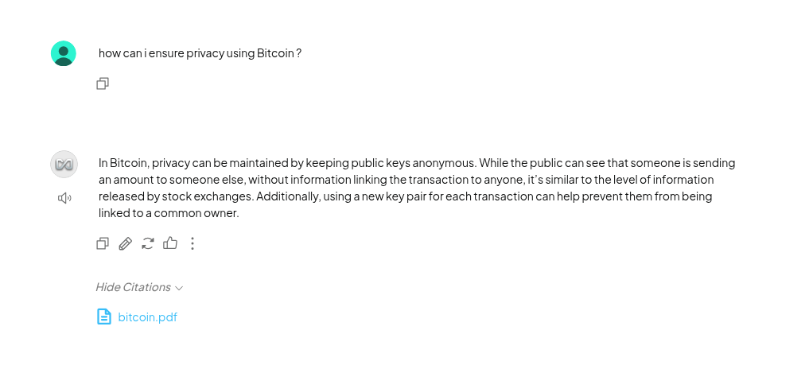

🥳🥳 Well done. You have completed the zero code rag example.

