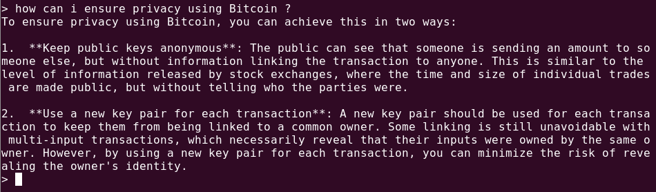

# RAG with RamaLama

The [RamaLama project](https://github.com/containers/ramalama) makes it easy to run AI locally by combining AI models and container technology. 

Ramalama has prepared all the software necessary to run an AI model in container images specific to your local GPU accelerator.

The RamaLama tool figures out what accelerator is available on your system and pulls the matching image. 

It then pulls the specified AI model to the local system.

Finally it creates a container from the image with the AI model mounted inside of it.

You can use the run command to activate a chatbot against the model, or serve the model via an OpenAI-compatible REST API.

You will need:

1. [**Podman**](https://podman.io/docs/installation) Podman is a utility provided as part of the libpod library. It can be used to create and maintain containers. 

1. A GPU that works with podman e.g. [NVIDIA](https://docs.nvidia.com/ai-enterprise/deployment/rhel-with-kvm/latest/podman.html)

## Architecture


## Install RamaLama for RAG

1. Install [RamaLama for your operating system](https://github.com/containers/ramalama). I found it easiest to use python:

    ```bash
    mkdir ramalama-demo && cd ramalama-demo
    python3 -m venv venv
    source venv/bin/activate
    pip3 install ramalama
    ````

1. Build a vector database image from some content. RamaLama uses [Docling](https://github.com/docling-project/docling) to parse common documents into text. These are then chunked and stored as embeddings in the [Qadrant](https://qdrant.tech/) vector db. You may specify multiple documents in different format (Markdown, PDF, Docx, Web etc). Note this will take some time to download images on the first run !

    Here we use the original [Bitcoin.pdf](https://bitcoin.org/bitcoin.pdf) paper as RAG content.

    ```bash
    ramalama rag \
        bitcoin.pdf \
        quay.io/eformat/ramalama-rag-data:latest
    ```

    

1. We need to convert an LLM into an OCI container for RamaLama to use.

    We are going to use a quantized model [lmstudio-community/Llama-3.2-3B-Instruct-GGUF](https://huggingface.co/lmstudio-community/Llama-3.2-3B-Instruct-GGUF). Download it locally - this may take some time as it is an 4GB model.

    ```bash
    curl -LO https://huggingface.co/lmstudio-community/Llama-3.2-3B-Instruct-GGUF/resolve/main/Llama-3.2-3B-Instruct-Q8_0.gguf?download=true
    ```

    Now run the RamaLama `convert` function giving it the name of the image we wish to produce:

    ```bash
    ramalama convert \
        ~/instructlab/models/Llama-3.2-3B-Instruct-Q8_0.gguf \
        quay.io/eformat/llama-3.2-3b-instruct-q8_0-gguf:latest
    ```

    


1. Now we can run our RAG. RamaLama creates a container with the RAG vector database and the model mounted into it. Then it starts a chatbot that can interact with the AI model using the RAG data.

    ```bash
    ramalama run \
        --rag quay.io/eformat/ramalama-rag-data:latest \
        quay.io/eformat/llama-3.2-3b-instruct-q8_0-gguf:latest
    ```

    

    We can chat to our RAG.

    > Q. how can i ensure privacy using Bitcoin ?

    And the answer:

    > A. To ensure privacy using Bitcoin, you can achieve this in two ways:
    1.  **Keep public keys anonymous**: The public can see that someone is sending an amount to someone else, but without information linking the transaction to anyone. This is similar to the level of information released by stock exchanges, where the time and size of individual trades are made public, but without telling who the parties were.
    2.  **Use a new key pair for each transaction**: A new key pair should be used for each transaction to keep them from being linked to a common owner. Some linking is still unavoidable with multi-input transactions, which necessarily reveal that their inputs were owned by the same owner. However, by using a new key pair for each transaction, you can minimize the risk of revealing the owner's identity. 

    

RamaLama also has options for `serving` an OpenAPI endpoint (see `ramalama serve`) as well as helping you get your RAG to production using OCI models. We will check these options out in the next section [Simple Rag](3-simple-rag/README.md)

🥳🥳 Well done. You have completed the RamaLama local rag example.


