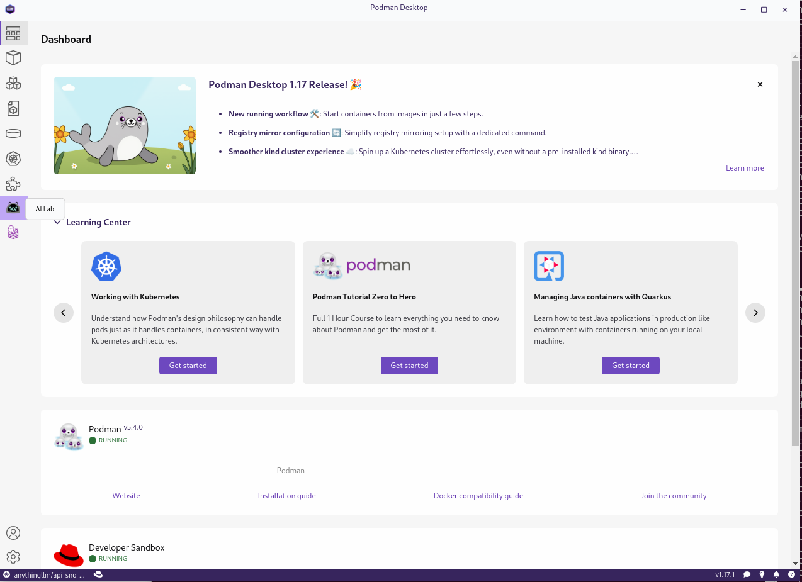
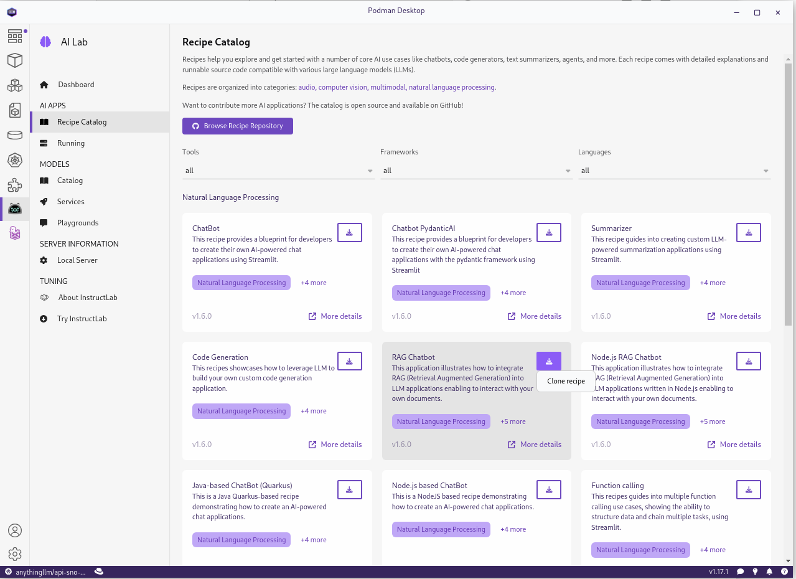
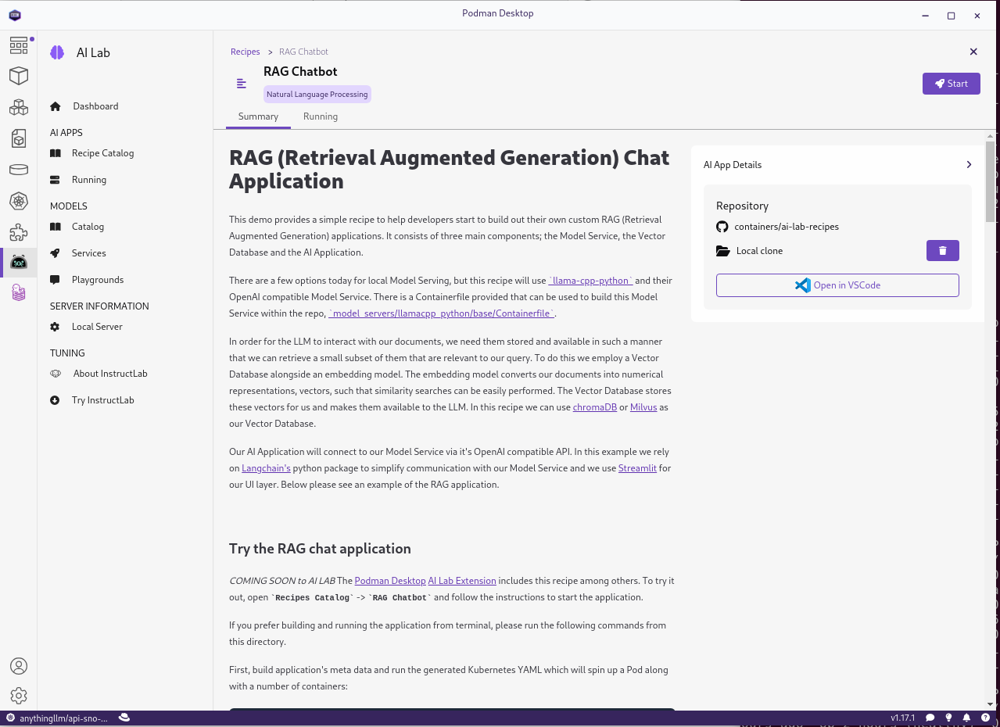
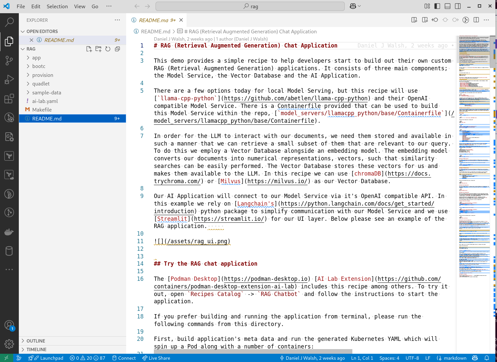
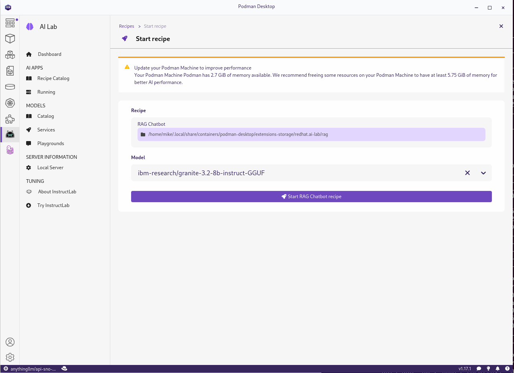
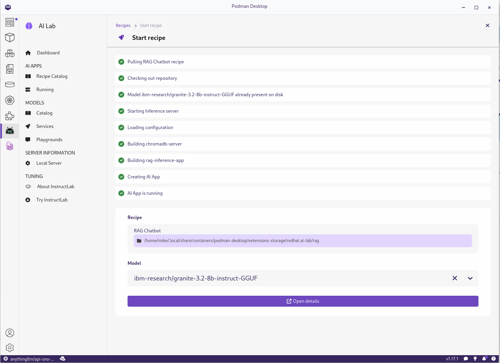
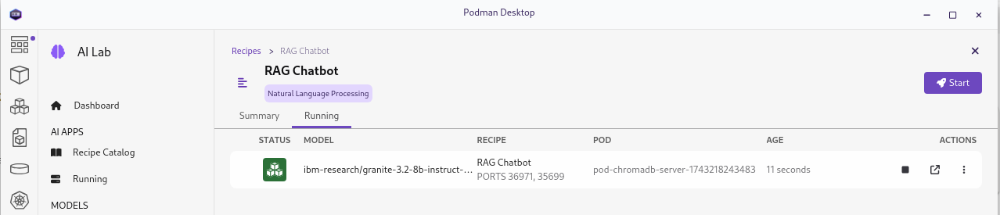
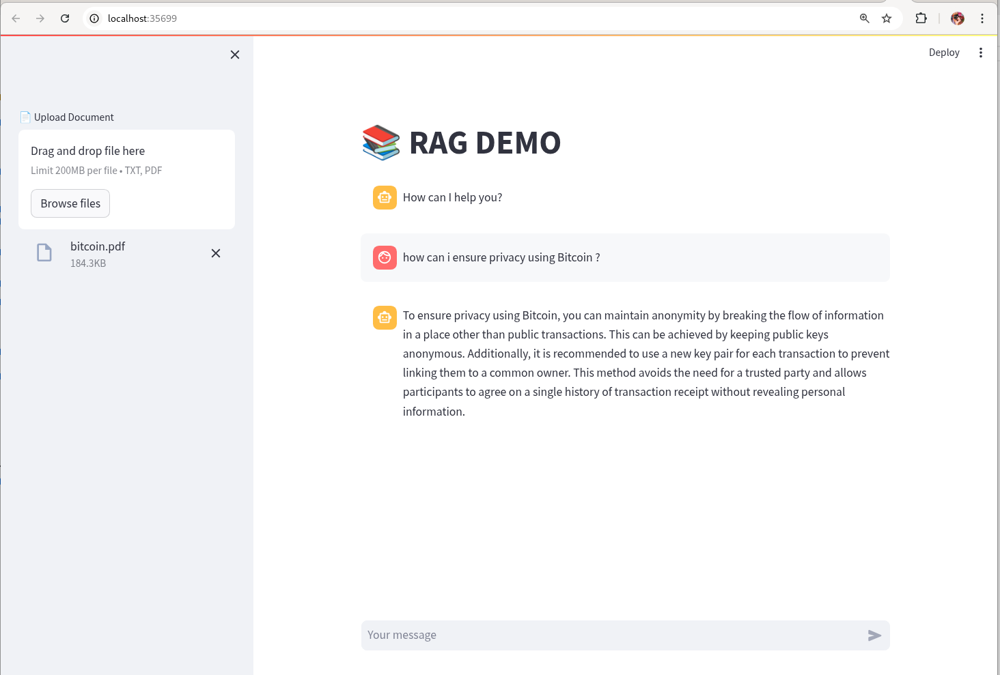

# Podman Desktop

RAG like a pro locally on your linux, mac, windows laptop.

## Pre-requisites

- VSCode
- (optional) GPU support on your laptop
- Fast internet connection (model download)

## GO!

1. Install [Podman Desktop](https://podman-desktop.io/docs/installation)

    

    Select **AI Lab** from the left-hand-side menu

1. Select `Recipe Catalog`. There are lots to choose from. We will try the `RAG Chatbot` recipe. Select `Clone recipe`.

    

1. We can then select to look at the code using `Open in VSCode` button and `Start` the recipe in the top right. Click `Start` and checkout the code and instructions.

    

    

1. Your recipe should start to download and configure. This may take some time.

    

    After some time, you should see all green success ✅ and be able to select `Open Details`.

    

1. Once started you should see the pods running in podman, and and browse to the Streamlit Chat UI by clicking on the arrow in the box under 'Actions'

    ```bash
    $ podman ps -a --format "{{.ID}} {{.Names}} {{.Created}}"
    2ddac785fa89 exciting_lovelace 2025-03-17 14:28:16
    be391de6c16c postgres 2025-03-21 07:29:54
    eee3d9981640 confident_rubin 2025-03-29 10:01:27
    caeba10a3689 7f9f17720935-infra 2025-03-29 13:17:23
    c4a4477c0ac0 chromadb-server-podified-1743218243524 2025-03-29 13:17:23
    b68183a68757 rag-inference-app-podified-1743218243525 2025-03-29 13:17:23
    ```

    

1. You can now chat to your locally running model and rag chatbot. Upload a PDF e.g. I'm going to use the original [Bitcoin.pdf](https://bitcoin.org/bitcoin.pdf) paper as my example. Now chat to your doc.

    > Q. how can i ensure privacy using Bitcoin ?

    And the answer:

    > A. To ensure privacy using Bitcoin, you can maintain anonymity by breaking the flow of information in a place other than public transactions. This can be achieved by keeping public keys anonymous. Additionally, it is recommended to use a new key pair for each transaction to prevent linking them to a common owner. This method avoids the need for a trusted party and allows participants to agree on a single history of transaction receipt without revealing personal information.

    

🥳🥳 Well done. You have completed the podman desktop local rag chatbot example.
