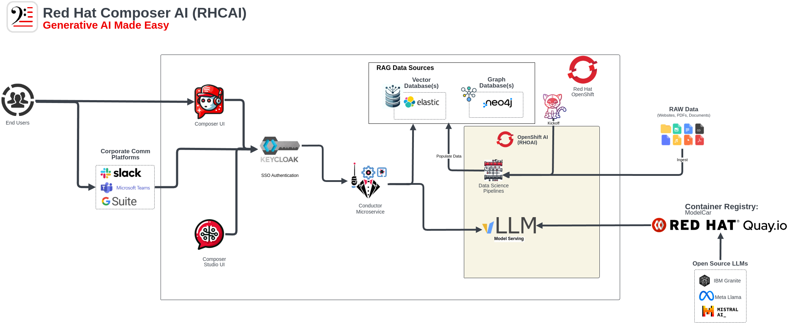

# Composer AI and building Productivity Apps

Composer AI is a service lead engagement designed to accelerate the adoption of generative AI.

It’s a full-stack AI deployment for OpenShift that includes all the necessary components for a Generative AI solution, including required operators, datasources, LLMs, and a custom application for querying the LLM.

Just browse over here for the LAB content and the push button deployment !

[**Composer AI Lab Content**](https://redhat-gpte-devopsautomation.github.io/composer-ai-showroom/modules/main/index.html)

[**Composer AI Demo Catalog Item**](https://catalog.demo.redhat.com/catalog?item=babylon-catalog-prod/rh1-2025.lab18-composer-ai.prod&utm_source=webapp&utm_medium=share-link")

🥳🥳 Well done. You have completed Composer-Ai with OpenShift.
