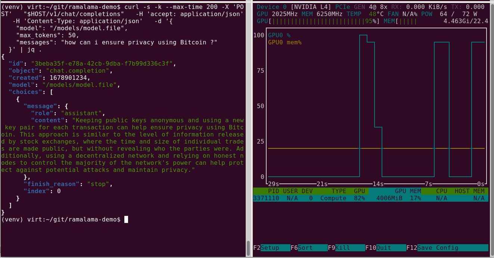

# RamaLama Getting to OpenShift

RamaLama lets you easily convert and use your RAG vector database and LLM as OCI-based models. This means that each individual part can be built and promoted just like normal containers.

1. We already saw in the local RamaLama example how you can convert a model into a container using `ramalama convert`

    ```bash
    ramalama convert \
        Llama-3.2-3B-Instruct-Q8_0.gguf \
        quay.io/eformat/llama-3.2-3b-instruct-q8_0-gguf:latest
    ```

    Similarly our RAG vector db was stored as an OCI image:

    ```bash
    quay.io/eformat/ramalama-rag-data:latest
    ```

    Don't worry if you have not done the local exercise, we can use some pre-created examples to deploy into OpenShift.

1. We can push our models into a container registry such as `quay.io`. You can skip this step if you have not created these from the local exercise. Replace the image repository names with your own.

    Login to the registry with your username and token.

    ```bash
    podman login quay.io
    ```

    Push our LLM container based model to quay. Replace the image repository names with your own:

    ```bash
    podman push quay.io/eformat/llama-3.2-3b-instruct-q8_0-gguf:latest
    ```

    Push our RAG vector db model to quay. Replace the image repository names with your own:

    ```bash
    podman push quay.io/eformat/ramalama-rag-data:latest
    ```

1. RamaLama can generate Kubernetes YAML's as well as quadlet based resources (for edge computing). Let's take a look at the Kuernetes example:

    ```bash
    ramalama serve \
      --name rag \
      --generate kube \
      --rag quay.io/eformat/ramalama-rag-data:latest \
      quay.io/eformat/llama-3.2-3b-instruct-q8_0-gguf:latest
    ```

    This will generate a file called `rag.yaml`. If we take at look at this file - it generates a Kubernetes `Deployment` that can run on the latest k8s versions using image based volume support for our LLM model image and RAG image:

    ```yaml
      volumes:
      - image:
          reference: quay.io/eformat/llama-3.2-3b-instruct-q8_0-gguf:latest
          pullPolicy: IfNotPresent
        name: model
      - image:
          reference: quay.io/eformat/ramalama-rag-data:latest
          pullPolicy: IfNotPresent
        name: rag
    ```

    Unfortunately this is still an [alpha feature](https://kubernetes.io/docs/concepts/storage/volumes/#image) in Kubernetes that is not available without setting the `FeatureGate ImageVolume` in k8s 1.31+

1. For now - let's workaround this by using a multi-stage `Containerfile` to build an image we can deploy to current OpenShift versions (4.16-4.18). You can skip this step if you have not created the images from the local exercise.

    Create a Containerfile that builds in our model and rag vectordb into one image. The `rag_framework` script is from the RamaLamma project.

    The [source files are in the folder here](https://github.com/eformat/ragit-dev/tree/main/docs/3-simple-rag/ramalama-rag) if you wish to run this yourself. The example container images are public if you have not created them locally yourself.

    ```bash
    cat <<'EOF' >> Containerfile
    FROM quay.io/eformat/llama-3.2-3b-instruct-q8_0-gguf:latest as model
    FROM quay.io/eformat/ramalama-rag-data:latest as rag
    FROM quay.io/ramalama/cuda:0.7
    COPY --from=model /models /models
    COPY --from=rag / /rag
    RUN rm -rf /tmp/fastembed_cache
    ADD rag_framework /usr/local/bin
    USER 0
    RUN chmod 777 -R /rag/vector.db/.lock
    USER 1001
    ```

    Build the container. Replace the image repository names with your own:

    ```bash
    podman build -t quay.io/eformat/ramalama-demo-rag:latest -f Containerfile
    ```

    Push to quay. Replace the image repository names with your own:

    ```bash
    podman push quay.io/eformat/ramalama-demo-rag:latest
    ```

1. Deploy our RamaLama application.

    Login to your OpenShift cluster.

    ```bash
    oc login -u user -p password https://api.mycluster.com:6443
    ```

    Create a project.

    ```bash
    oc new-project ramalama
    ```

    Deploy the RamaLama application. The [rag file](https://raw.githubusercontent.com/eformat/ragit-dev/refs/heads/main/docs/3-simple-rag/ramalama-rag/rag.yaml) is located here in git. Replace the `image:` if you pushed your own version.

    ```bash
    oc apply -f rag.yaml
    ```

    Expose a Service and a Route so we can talk to the RAG API endpoint.

    ```bash
    oc expose deployment rag --port=8080
    oc create route edge --service=rag --port=8080 --insecure-policy=Redirect
    oc annotate route rag haproxy.router.openshift.io/timeout=200s
    ```

1. Chat to our RAG API using curl.

    Grab the Host URL for our exposed Route.

    ```bash
    HOST=$(oc -n ramalama get route rag --template='{{ .spec.host }}')
    ```

    Test the RAG and LLM model.

    ```bash
    curl -s -k --max-time 200 -X 'POST' \
      "$HOST/v1/chat/completions" \
      -H 'accept: application/json' \
      -H 'Content-Type: application/json' \
      -d '{
          "model": "/models/model.file",
          "max_tokens": 50,
          "messages": "how can i ensure privacy using Bitcoin ?"
      }' | jq .
    ```

    You should receive a chat response similar to this.

    ```json
    {
        "id": "827773c0-24ca-4200-8e60-11fb53d27c5f",
        "object": "chat.completion",
        "created": 1678901234,
        "model": "/models/model.file",
        "choices": [
            {
            "message": {
                "role": "assistant",
                "content": "To ensure privacy using Bitcoin, you can maintain anonymity by keeping your public keys anonymous. This can be achieved by not announcing your public keys publicly. Additionally, using a new key pair for each transaction can help prevent linking transactions to a common owner. However, it's worth noting that some linking is unavoidable with multi-input transactions, which can reveal that the inputs were owned by the same owner.\n\nIn other words, to ensure privacy in Bitcoin, you should:\n\n1. Keep your public keys private (i.e., don't announce them publicly).\n2. Use a new key pair for each transaction.\n3. Be aware that some linking is unavoidable with multi-input transactions.\n\nBy following these steps, you can help maintain your anonymity and ensure some level of privacy when using Bitcoin."
            },
            "finish_reason": "stop",
            "index": 0
            }
        ]
    }
    ```

    

🥳🥳 Well done. You have completed deploying RamaLama RAG to OpenShift example.
