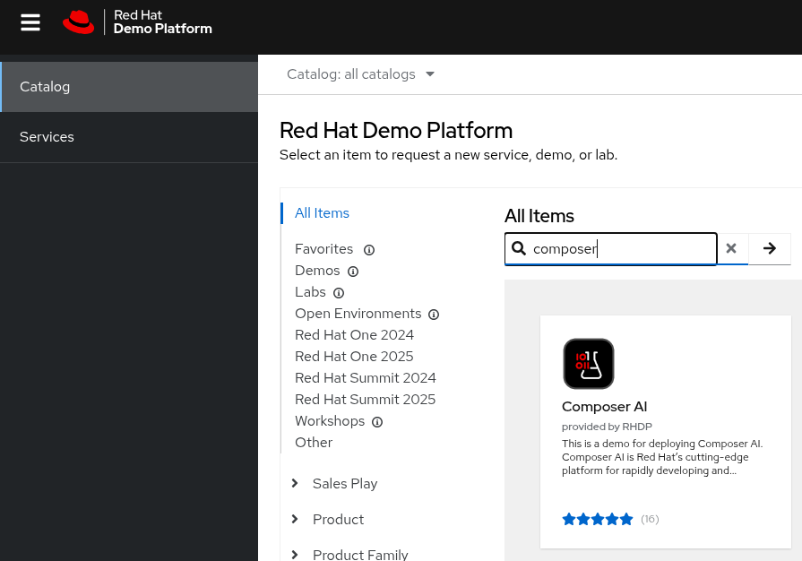

# Simple RAG

This will demo Simple RAG on RHOAI.

1. Oser yourself a [Composer.ai](https://redhat-composer-ai.github.io/documentation/demo/walkthrough) LAB in demo.redhat.com

## Exercises

We extend the [local exercises](2-local-rag/README.md) by deploying them to RHOAI. The high level steps will be as follows:

Choose a framework:

- []
- [langchain](https://python.langchain.com/docs/tutorials/rag/)
- [llamaindex](https://docs.llamaindex.ai/en/stable/examples/low_level/oss_ingestion_retrieval/)
- [lamastack](https://llama-stack.readthedocs.io/en/latest/getting_started/)
- [quarkus/langchain4j](https://docs.quarkiverse.io/quarkus-langchain4j/dev/easy-rag.html)
- etc

Use it to connect to a [vector store](https://docs.llamaindex.ai/en/stable/module_guides/storing/vector_stores/):

- postgres
- milvus
- chromadb
- etc

Serve an LLM model:

- using MaaS
- using RHOAI
- etc

Show howto do a simple rag architecture with RHOAI.

🤑 !! PROFIT !! 🤑

In the next section [Complex Rag](4-complex-rag/README.md) - we will learn some techniques that will add quality control to our RAG so we can get it to production.

🚗 Let's go ! 🚗
