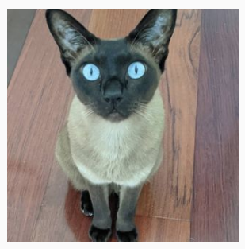

# RAGIT ! - ragit.dev

A hands-on guide to Retrieval Augmented Generation (RAG) with containers and OpenShift.

<!-- panels:start -->
<!-- div:floating-cat -->

<!-- panels:end -->

## 🦆 Conventions

When running through the exercise, we're tried to call out where things need replacing. The key ones are anything inside an `<>` should be replaced. For example, if your team is called `biscuits` then in the instructions if you see `\<USER_NAME\>` this should be replaced with `biscuits` like so:
    <div class="highlight" style="background: #f7f7f7">
    <pre><code class="language-bash">
    name: <\USER_NAME\>
    # ^ this becomes
    name: biscuits
    </code></pre></div>

There are lots of code blocks for you to copy and paste. They have little ✂️ icon on the right if you move your cursor on the code block.

```bash
echo "like this one :)"
```

But there are also some blocks that you shouldn't copy and paste which doesn't have the copy✂️ icon. That means you should validate your outputs or yamls against the given block.

!> **Important** notices - pay heed if you want to stay on-piste ! ⛷️

?> **Tip** notices - handy help and areas to further explore 💁
